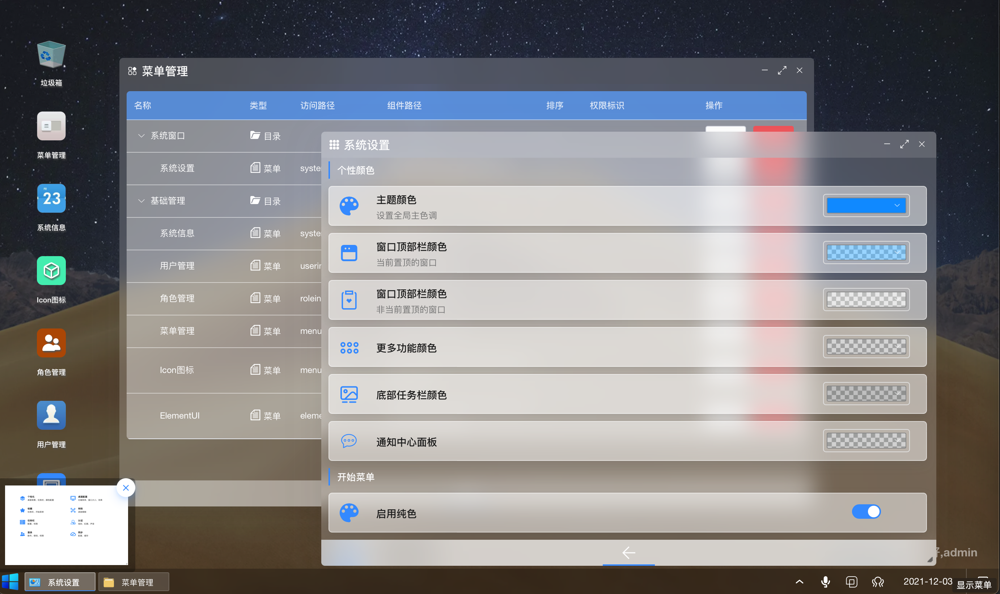
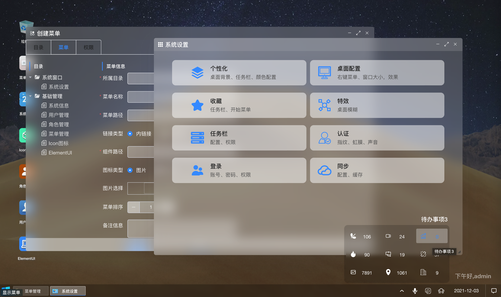
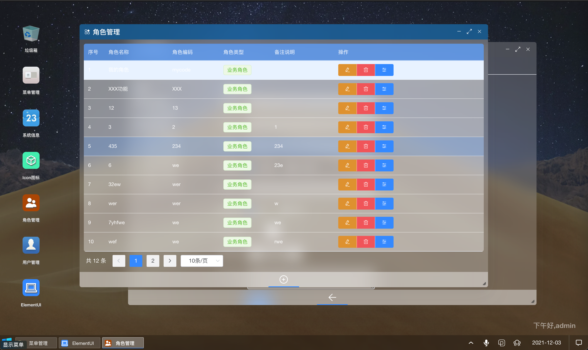

# 框架
模拟windows系统的操作模式，将后端管理系统通过大家熟悉的window界面管理方式实现。实现技术就是简单的Vue框架，大家看看都明白了。

后端项目：https://gitee.com/cjlang/cj-master.git

## 设计说明
+ 1、窗口展示，主要是动态更新router的路由表，然后每次打开一个窗口，创建一个新的路径，跳转至这个路径即可。
+ 2、动画效果：就是vue提供的transition标签，自己定义一些基础动画，还有css样式的transition属性，以及逐帧动画和CSS3的3D动画。
+ 3、窗口拖动：jquery的draggable和droppable方法。
+ 4、消息事件：本项目交互方式和普通项目不一样，存在很多状态需要随时变化，通过统一的消息事件来告知，所以项目里面有很多事件不断调用。

## 界面效果

